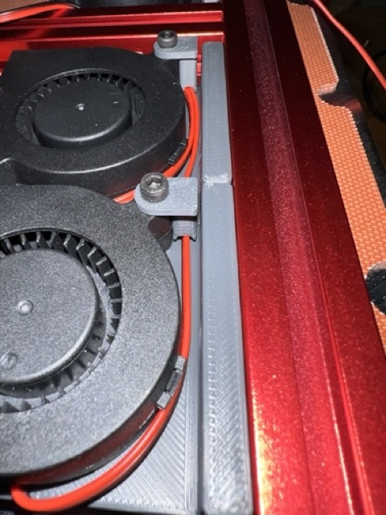
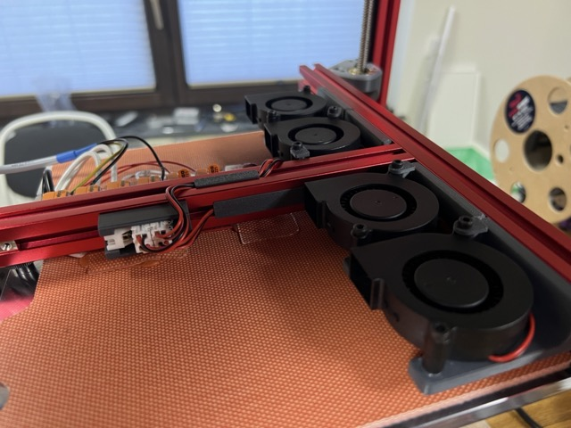
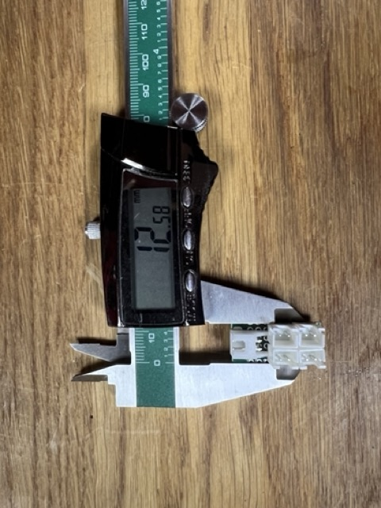
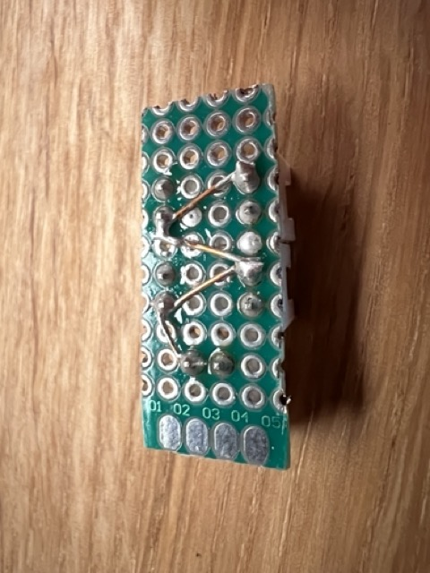
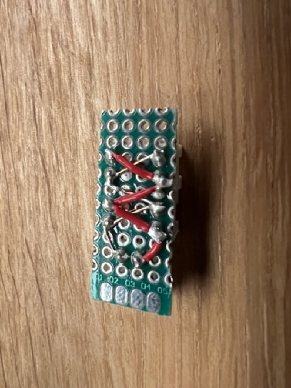
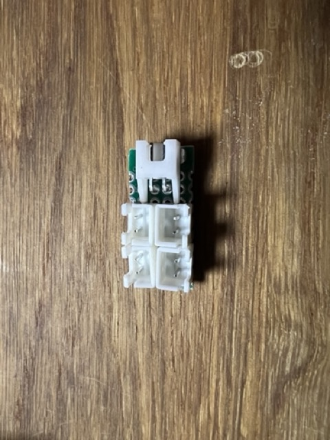
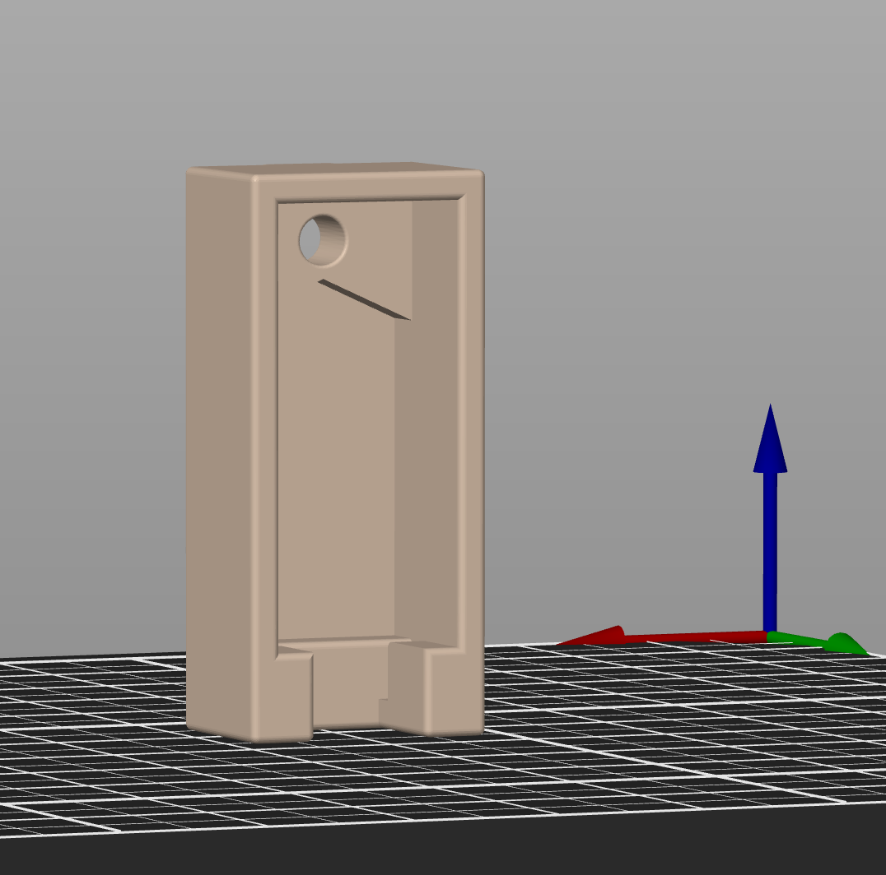
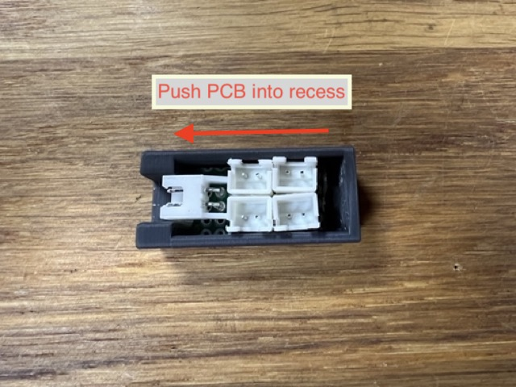
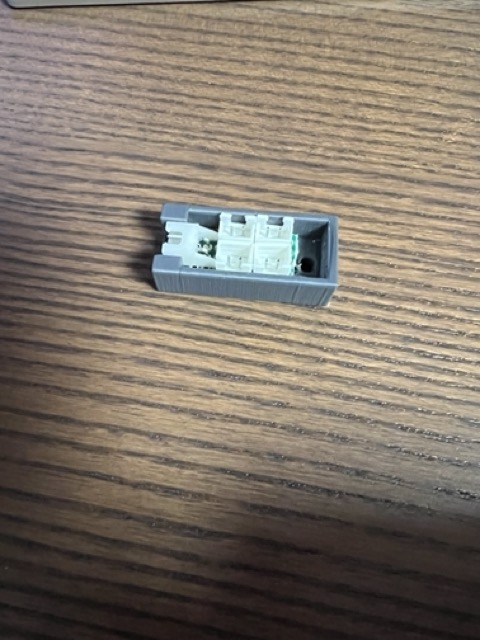

# Cable management for Trident bed fans

[Trident Bed Fans](https://github.com/VoronDesign/VoronUsers/tree/master/printer_mods/CannedBass/Trident_Bed_Fans)

[Extrusion Cover](https://github.com/VoronDesign/VoronUsers/tree/master/printer_mods/filotto78/6mm_slot_cover)

## BOM

 - 1x M3x8 SHCS
 - 1x M3 T-Nut
 - 1x Universal PCB 20mm wide 2.54mm pitch
 - 4x JST XH-2 vertical
 - 1x JST XH-2 rectangular
 - Wire 0.14mm2 or e.g. twisted pair wire only for ground wiring.

### Images

